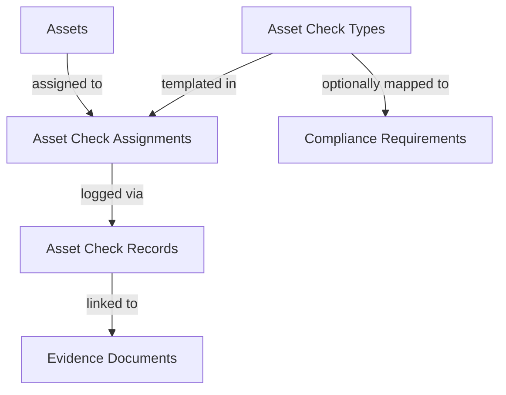

# Asset Assurance and Maintenance System (Asset Matrix)

This document describes the design, architecture, data model, calculation engine, and integration patterns of the **Asset Matrix Assurance and Maintenance System** in Vygilence.

---

## 1. System Architecture

The Asset Matrix system provides structured assurance and compliance management for physical items such as vehicles, trailers, equipment, calibrators, and facility checklist checkpoints. 

- **Assets**: The physical items being tracked (e.g., forklift, delivery truck).
- **Asset Check Types**: Templates defining compliance checks (e.g., annual safety test, weekly inspection, calibration).
- **Asset Check Assignments**: Active compliance schedules tracking when the next check is due.
- **Asset Check Records**: Immutable logs of completed checks.
- **Asset Check Evidence Links**: Secure mappings tying completions to vault documents.

---

## 2. Database Schema

The database model is defined in `supabase/migrations/20260611000000_asset_matrix_system.sql` and appended to `supabase/schema.sql`.

### Tables

#### `assets`
- `id` (uuid, primary key)
- `organisation_id` (uuid, foreign key to organizations)
- `asset_number` (text, unique per tenant)
- `name` (text, e.g. "HGV Truck #01")
- `asset_type` (text, e.g. "Vehicle")
- `category` (text, e.g. "HGV")
- `registration_number` (text)
- `serial_number` (text)
- `make` (text)
- `model` (text)
- `location` (text)
- `department` (text)
- `owner` (text)
- `status` (`'active' | 'inactive' | 'archived'`)
- `notes` (text)
- Timestamps: `created_at`, `updated_at`, `archived_at`

#### `asset_check_types`
- `id` (uuid, primary key)
- `organisation_id` (uuid)
- `title` (text, e.g. "Road Tax renewal")
- `category` (text)
- `description` (text)
- `default_frequency_value` (integer)
- `default_frequency_unit` (`'days' | 'weeks' | 'months' | 'years'`)
- `default_warning_days` (integer)
- `evidence_required` (boolean)
- `risk_level` (`'Low' | 'Medium' | 'High' | 'Critical'`)
- `default_status` (text)
- `active` (boolean)

#### `asset_check_assignments`
- `id` (uuid, primary key)
- `organisation_id` (uuid)
- `asset_id` (uuid, references assets)
- `asset_check_type_id` (uuid, references asset_check_types)
- `required` (boolean)
- `frequency_value` (integer)
- `frequency_unit` (`'days' | 'weeks' | 'months' | 'years'`)
- `warning_days` (integer)
- `first_due_date` (timestamptz)
- `next_due_date` (timestamptz)
- `last_completed_date` (timestamptz)
- `last_expiry_date` (timestamptz)
- `status` (text)
- `notes` (text)
- `active` (boolean)

#### `asset_check_records`
- `id` (uuid, primary key)
- `organisation_id` (uuid)
- `asset_id` (uuid, references assets)
- `asset_check_type_id` (uuid, references asset_check_types)
- `asset_check_assignment_id` (uuid, references asset_check_assignments)
- `completed_at` (timestamptz)
- `valid_from` (timestamptz)
- `valid_until` (timestamptz)
- `result_status` (text)
- `performed_by` (text)
- `reference` (text)
- `notes` (text)

#### `asset_check_evidence_links`
- `id` (uuid, primary key)
- `organisation_id` (uuid)
- `asset_id` (uuid)
- `asset_check_assignment_id` (uuid)
- `asset_check_record_id` (uuid, references asset_check_records)
- `document_id` (uuid, references evidence_documents)

---

## 3. Row-Level Security (RLS)

All tables strictly enforce organization isolation:
- **`SELECT`**: Allowed for authenticated users if `public.is_organization_member(organisation_id)` is true.
- **`INSERT/UPDATE/DELETE`**: Allowed for authenticated users if `public.can_write_organization(organisation_id)` is true.
- Performance indexes are added to `organisation_id` and references (`asset_id`, `asset_check_type_id`) to optimize reads.

---

## 4. Compliance Calculation Engine

The calculation engine located at `src/lib/assetEngine.ts` enforces the canonical check status hierarchy:

1. **`N/A`**: Mapped if the asset is archived/inactive or the check assignment is inactive/not required.
2. **`Expired`**: Mapped if the projected due date (`next_due_date`) has passed.
3. **`Overdue`**: Mapped if a due date exists and has passed, or if a check is required but has never been completed.
4. **`Expiring Soon`**: Mapped if the due date is in the future but falls within the warning window (`next_due_date - now <= warning_days`).
5. **`Compliant`**: Mapped if the check is completed and the due date is in the future beyond the warning window.
6. **`Missing`**: Mapped if no completion record or due date is configured for a required check type.

---

## 5. Integrations & UX

- **Global Search**: Search records scan matching asset numbers, registration numbers, makes, models, and titles. Results support deep-linking directly into details.
- **Reporting Hub**: Aggregates metrics to build status distributions and registers all assets for compliance tracking.
- **Audit Logging**: Appends logs to the audit trail on asset registration, edits, check assignments, and completion recordings.
