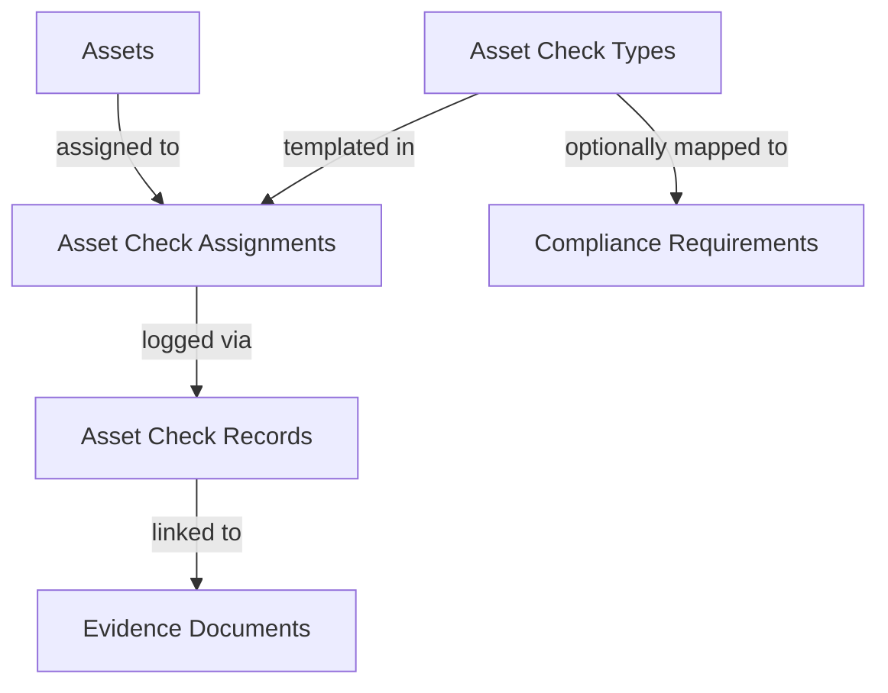

# Asset Assurance and Maintenance System (Asset Matrix)

This document describes the design, architecture, data model, calculation engine, and integration patterns of the **Asset Matrix Assurance and Maintenance System** in Vygilence.

---

## 1. System Architecture

The Asset Matrix system provides structured assurance tracking for physical items such as vehicles, trailers, equipment, calibrators, and facility checklist checkpoints.

- **Assets**: The physical items being tracked (e.g., forklift, delivery truck).
- **Asset Check Types**: Templates defining compliance checks (e.g., annual safety test, weekly inspection, calibration).
- **Asset Check Assignments**: Active compliance schedules tracking when the next check is due.
- **Asset Check Records**: Dated logs of completed checks. Database immutability is not currently enforced.
- **Asset Check Evidence Links**: Secure mappings tying completions to vault documents.

---

## 2. Database Schema

The database model is defined in `supabase/migrations/20260611000000_asset_matrix_system.sql` and appended to `supabase/schema.sql`.

### Tables

#### `assets`
- `id` (uuid, primary key)
- `organisation_id` (uuid, foreign key to organizations)
- `asset_number` (text; uniqueness is not currently enforced)
- `name` (text, e.g. "HGV Truck #01")
- `asset_type` (text, e.g. "Vehicle")
- `category` (text, e.g. "HGV")
- `registration_number` (text)
- `serial_number` (text)
- `make` (text)
- `model` (text)
- `location` (text)
- `department` (text)
- `owner` (text)
- `status` (`'active' | 'inactive' | 'archived'`)
- `notes` (text)
- Timestamps: `created_at`, `updated_at`, `archived_at`

#### `asset_check_types`
- `id` (uuid, primary key)
- `organisation_id` (uuid)
- `title` (text, e.g. "Road Tax renewal")
- `category` (text)
- `description` (text)
- `default_frequency_value` (integer)
- `default_frequency_unit` (`'days' | 'weeks' | 'months' | 'years'`)
- `default_warning_days` (integer)
- `evidence_required` (boolean)
- `risk_level` (`'Low' | 'Medium' | 'High' | 'Critical'`)
- `default_status` (text)
- `active` (boolean)

#### `asset_check_assignments`
- `id` (uuid, primary key)
- `organisation_id` (uuid)
- `asset_id` (uuid, references assets)
- `asset_check_type_id` (uuid, references asset_check_types)
- `required` (boolean)
- `frequency_value` (integer)
- `frequency_unit` (`'days' | 'weeks' | 'months' | 'years'`)
- `warning_days` (integer)
- `first_due_date` (date)
- `next_due_date` (date)
- `last_completed_date` (date)
- `last_expiry_date` (date)
- `status` (text)
- `notes` (text)
- `active` (boolean)

#### `asset_check_records`
- `id` (uuid, primary key)
- `organisation_id` (uuid)
- `asset_id` (uuid, references assets)
- `asset_check_type_id` (uuid, references asset_check_types)
- `asset_check_assignment_id` (uuid, references asset_check_assignments)
- `completed_at` (date)
- `valid_from` (date)
- `valid_until` (date)
- `result_status` (text)
- `performed_by` (text)
- `reference` (text)
- `notes` (text)

#### `asset_check_evidence_links`
- `id` (uuid, primary key)
- `organisation_id` (uuid)
- `asset_id` (uuid)
- `asset_check_assignment_id` (uuid)
- `asset_check_record_id` (uuid, references asset_check_records)
- `document_id` (uuid, references evidence_documents)

---

## 3. Row-Level Security (RLS)

All asset tables enable RLS and use organisation membership checks:
- **`SELECT`**: Allowed for authenticated users if `public.is_organization_member(organisation_id)` is true.
- **`INSERT/UPDATE/DELETE`**: Allowed for authenticated users if `public.can_write_organization(organisation_id)` is true.
- Relationship policies also require referenced assets, check types, records, evidence documents, and requirements to belong to the same organisation.
- Performance indexes are added to `organisation_id` and references (`asset_id`, `asset_check_type_id`) to optimize reads.

The migration is local repository SQL only. It has not been applied remotely by this implementation review.

---

## 4. Compliance Calculation Engine

The calculation engine located at `src/lib/assetEngine.ts` supplies the canonical check status hierarchy used by the matrix, dashboard, and asset report:

1. **`Archived` / `Inactive` / `Not Required` / `Unknown`**: Excluded from active assurance totals.
2. **`Expired`**: The latest validity date has passed.
3. **`Overdue`**: The due date has passed or the latest check result failed.
4. **`Due Soon`**: The validity/due date falls within the configured warning window.
5. **`Valid`**: A completed check remains valid beyond the warning window.
6. **`Missing`**: A required completion or required evidence link is absent.

---

## 5. Integrations & UX

- **Global Search**: Search records scan matching asset numbers, registration numbers, makes, models, and titles. Results support deep-linking directly into details.
- **Reporting Hub**: Aggregates metrics to build status distributions and registers all assets for compliance tracking.
- **Evidence**: Check completion can link an existing private Evidence Vault document. Direct upload and unlink controls are not implemented in the Asset Matrix.
- **Archiving**: The current decommission control archives the asset and retains history. A restore UI is not yet implemented.
- **Audit Logging**: Asset create/update/archive operations use existing activity logging. Check-type, assignment, completion, and evidence-link audit coverage remains incomplete.
- **Requirements**: Optional requirement-link storage exists, but asset checks do not alter requirement readiness scores.
- **Actions**: The current asset action display is a title-based convenience view, not a persisted asset/action relationship.
