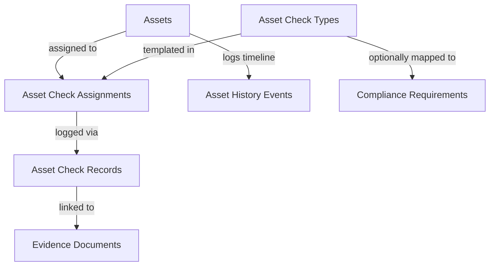

# Asset Assurance and Maintenance System (Asset Matrix)

This document describes the design, architecture, data model, calculation engine, and integration patterns of the **Asset Matrix Assurance and Maintenance System** in AssureCore.

---

## 1. System Architecture

The Asset Matrix system provides structured assurance tracking for physical items such as vehicles, trailers, equipment, calibrators, and facility checklist checkpoints.

- **Assets**: The physical items being tracked (e.g., forklift, delivery truck).
- **Asset Check Types**: Templates defining compliance checks (e.g., annual safety test, weekly inspection, calibration).
- **Asset Check Assignments**: Active compliance schedules tracking when the next check is due.
- **Asset Check Records**: Dated logs of completed checks.
- **Asset Check Evidence Links**: Secure mappings tying completions to vault documents.
- **Asset History Events**: Timeline log tracking repairs, maintenance, calibration adjustments, and general asset events.

---

## 2. Database Schema

The database model is defined in `supabase/migrations/20260611000000_asset_matrix_system.sql` & `supabase/migrations/20260611000001_asset_matrix_improvements.sql` and appended to `supabase/schema.sql`.

### Tables

#### `asset_categories`
- `id` (uuid, primary key)
- `organisation_id` (uuid, references organizations)
- `parent_id` (uuid, nullable, references asset_categories)
- `name` (text, not null)
- `description` (text, nullable)
- `sort_order` (integer)
- `active` (boolean)
- Timestamps: `created_at`, `updated_at`, `archived_at`

#### `assets`
- `id` (uuid, primary key)
- `organisation_id` (uuid, foreign key to organizations)
- `category_id` (uuid, foreign key to asset_categories)
- `asset_number` (text)
- `name` (text, e.g. "HGV Truck #01")
- `asset_type` (text, e.g. "Vehicle")
- `category` (text, e.g. "HGV")
- `registration_number` (text)
- `serial_number` (text)
- `make` (text)
- `model` (text)
- `location` (text)
- `department` (text)
- `owner` (text)
- `status` (`'active' | 'inactive' | 'archived'`)
- `notes` (text)
- Timestamps: `created_at`, `updated_at`, `archived_at`

#### `asset_check_types`
- `id` (uuid, primary key)
- `organisation_id` (uuid)
- `title` (text, e.g. "Road Tax renewal")
- `category` (text)
- `description` (text)
- `default_frequency_value` (integer)
- `default_frequency_unit` (`'days' | 'weeks' | 'months' | 'years'`)
- `default_warning_days` (integer)
- `evidence_required` (boolean)
- `risk_level` (`'Low' | 'Medium' | 'High' | 'Critical'`)
- `default_status` (text)
- `active` (boolean)

#### `asset_check_assignments`
- `id` (uuid, primary key)
- `organisation_id` (uuid)
- `asset_id` (uuid, references assets)
- `asset_check_type_id` (uuid, references asset_check_types)
- `required` (boolean)
- `frequency_value` (integer)
- `frequency_unit` (`'days' | 'weeks' | 'months' | 'years'`)
- `warning_days` (integer)
- `first_due_date` (date)
- `next_due_date` (date)
- `last_completed_date` (date)
- `last_expiry_date` (date)
- `status` (text)
- `notes` (text)
- `active` (boolean)

#### `asset_check_records`
- `id` (uuid, primary key)
- `organisation_id` (uuid)
- `asset_id` (uuid, references assets)
- `asset_check_type_id` (uuid, references asset_check_types)
- `asset_check_assignment_id` (uuid, references asset_check_assignments)
- `completed_at` (date)
- `valid_from` (date)
- `valid_until` (date)
- `result_status` (text)
- `performed_by` (text)
- `reference` (text)
- `notes` (text)

#### `asset_check_evidence_links`
- `id` (uuid, primary key)
- `organisation_id` (uuid)
- `asset_id` (uuid)
- `asset_check_assignment_id` (uuid)
- `asset_check_record_id` (uuid, references asset_check_records, nullable)
- `document_id` (uuid, references evidence_documents)

#### `asset_history_events`
- `id` (uuid, primary key)
- `organisation_id` (uuid)
- `asset_id` (uuid, references assets)
- `event_type` (text, e.g. `'repair' | 'maintenance' | 'audit' | 'status_change'`)
- `event_date` (date)
- `title` (text)
- `description` (text)
- `performed_by` (text)
- `cost` (numeric, nullable)
- `notes` (text, nullable)
- Timestamps: `created_at`, `updated_at`

---

## 3. Row-Level Security (RLS)

All asset tables enable RLS and use organisation membership checks:
- **`SELECT`**: Allowed for authenticated users if `public.is_organization_member(organisation_id)` is true.
- **`INSERT/UPDATE/DELETE`**: Allowed for authenticated users if `public.can_write_organization(organisation_id)` is true.
- Foreign key cascading deletes ensure that when an asset is deleted, its check assignments, records, and history are cleaned up securely.
- Performance indexes are added to `organisation_id` and reference columns to optimize reads.

---

## 4. Compliance Calculation Engine

The calculation engine located at `src/lib/assetEngine.ts` supplies the canonical check status hierarchy:

1. **`Expired`**: The latest validity date has passed.
2. **`Overdue`**: The due date has passed or the check is required but never completed.
3. **`Expiring Soon`**: The due date falls within the configured warning window.
4. **`Compliant`**: A completed check remains valid beyond the warning window.
5. **`Missing`**: A required compliance check has no historical completion.
6. **`N/A`**: The check is marked as not required.

---

## 5. UI & UX Improvements

### Collapsible Category Tree Sidebar
- **Hierarchical Sidebar**: Renders parent categories and child subcategories on the left of the Matrix table page with active counts and direct filter tags.
- **Category Manager Modal**: Create parent categories and child subcategories, update names, and archive/restore categories. Manual reordering is not implemented.

### Centered Floating Workspace Modal
- Centered floating layout containing an asset workspace, featuring sidebar metadata detail forms, interactive tabs, contextual action rails, and Escape key down listener for fast navigation.
- **Interactive Overview Dashboard Tab**: Shows overall asset assurance compliance score, next due checks, urgent compliance gaps, and assigned check cards.
- **Drag-and-Drop Interactive Upload**: Allows dragging a file onto the workspace backdrop or check cards to open the context-linking modal.
- **Context-Linking Modal**: Interactive flow to specify issue/expiry dates, notes, and targets (General Record, Specific Check, Requirement, Action / Task, or Maintenance History event).

### Grid Display Modes
- **`Detailed`**: Displays full cells with title, date, check warning badge, and check action items.
- **`Compact`**: Rotated headers, compact cells showing status badges only.
- **`Status only`**: Micro-badges to compress screen space for high-volume fleets.
- **Column Grouping**: Columns can be dynamically grouped/sorted by Category or Risk level.

### Large Workspace Tabs & Side Rails
- **Left Rail**: Detailed asset profile with category assignment select dropdown, edit details controls, and archive button.
- **Checks Tab**: Add/remove schedules, toggle required state.
- **Evidence Tab**: Interactive list of linked evidence vault files.
- **Requirements Tab**: Map compliance frameworks.
- **Actions Tab**: Register corrective actions.
- **History Tab**: Combined timeline of scheduled checks and ad-hoc history logs (repairs, maintenance, costs, odometer).
- **Notes Tab**: Full notes textarea editor.
- **Right Context Rail**: If a check cell or completion is active, renders the log check form. Otherwise, displays overview quick action advice context.

---

## 6. Integration Suite

- **Dashboard**: Signals expiring/overdue assets in the Attention Centre and provides quick-action buttons; groups asset status metrics by taxonomy categories.
- **Reports**: "Locations & Assets" tab with maintenance history logs, repairs timeline, cost summary metrics, and category filtering/grouping.
- **Global Search**: Indexes active asset and taxonomy-category metadata; supports deep-linking with `?asset=ASSET_ID` or `?category=CATEGORY_ID`.
- **Audit Trail**: Asset create/update/archive uses existing activity logging. Taxonomy, check completion, history, and evidence-link audit coverage remains incomplete.
- **Evidence Vault**: Displays linked assets list in the document detail sidebar with click backlinks (`/dashboard/matrix?asset=ASSET_ID`) to auto-open the asset details, and unlinking capability.
