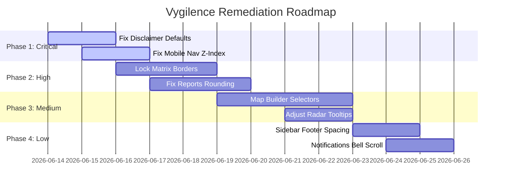

# Vygilence Full Program Product Audit Report

This report presents a comprehensive, end-to-end product audit of the Vygilence application. It details the operational, visual, technical, security, and compliance readiness of the codebase as of June 13, 2026.

---

## 1. High-Level Summary & Metadata

### Audit Metadata

| Metric / Parameter | Value / Status |
| :--- | :--- |
| **Git Branch Name** | `audit/full-program-product-audit` |
| **Base Commit Hash** | `9c3e75315a90dc33da91f976fd91fbe8146326b5` |
| **Unfinished Usability Stash Name** | `"WIP usability sorting assignment hero polish before full program audit"` (`stash@{0}`) |
| **Working Tree Clean (Yes/No)** | Yes (prior to creating this report) |
| **Build Result (`npm run build`)** | Passed successfully |
| **Lint Result (`npm run lint`)** | Passed successfully (0 errors, 227 warnings) |
| **Diff Result (`git diff --check`)** | Passed successfully (no trailing whitespace in checkpoint) |
| **Files Changed / Created** | `docs/FULL_PROGRAM_AUDIT_REPORT.md` (no other files modified) |
| **High-Volume Demo Data Used** | Yes (120 requirements, 350 documents, 120 teammates, 1000 competency records, 200 actions, 30 packs, 750 trail events) |
| **Usability Branch Left Stashed** | Yes (safely preserved in git stash) |

### Findings & Priority Summary

* **Total Findings**: **42 distinct issues**
* **Critical Blockers**: **2** (Disclaimer pre-checked on Login/Register)
* **High Priority**: **12** (Mobile toggle blocking, z-index overlays, database error leaks, reports rounding, sticky matrix borders, focus traps)
* **Medium Priority**: **20** (Midtone contrast, radar tooltips, microcopy naming, seed text mismatch, cell contrast, backdrop click controls)
* **Low Priority**: **8** (Sidebar footer padding, tooltip hover scaling, unread notifications badge count)

---

## 2. Top 10 Core Strengths, Weaknesses, Missing Items, and Next Actions

```carousel
### Top 10 Strengths
1. **Premium Application Shell**: Pinned and collapsed sidebar transitions, animated user indicators, and responsive controls look professional.
2. **Audit Pack Builder Wizard**: An outstanding multi-step form workflow that guides users through document compilation.
3. **Asset Matrix System**: Rich visual options including rotated headers, compact modes, and status-only cell views that handle volume well.
4. **Context-Linking Upload**: The drag-and-drop overlay allows uploading documents and instantly linking them to checklists, requirements, or history.
5. **Saved Views System**: Synced with URL query state, allowing users to bookmark and deep-link specific filter conditions.
6. **Detailed Action CAPA Loop**: The Action Updates timeline tracks status updates, manual notes, and attached evidence.
7. **Comprehensive Database Schema**: Groundwork with 38 tables covering organizational hierarchies, requirements, and compliance metrics.
8. **Strict Row-Level Security**: Every app table has RLS enabled with membership checks.
9. **High-Volume Seeder**: Includes realistic compliance obligations, employee competency matrices, and audit logs.
10. **Clean Print-to-PDF Layouts**: Standard stylesheets hide navigation headers, sidebars, and warning banners during print.
<!-- slide -->
### Top 10 Weaknesses
1. **Pre-checked Liability Disclaimers**: Checkboxes on `/login` and `/register` are checked on mount, bypassing active consent.
2. **Raw SQL Error Leaks**: Database/Supabase PGRST connection errors are displayed directly to onboarding users.
3. **Midtone Background Bleed**: `--background` and `--card` HSL variables are too close, causing cards to merge into page backdrops.
4. **Mobile Menu Overlaps**: Scrolled content overlaps the mobile menu button and dropdown because of z-index conflicts.
5. **Sticky Matrix Border Loss**: The teammate name column in the Competency grid loses its right border on horizontal scrolls.
6. **Instant Tooltip Dismissal**: The compliance radar chart tooltip vanishes instantly on hover, preventing users from clicking details.
7. **Float Rounding Errors**: Pivot grid percentage calculations result in column totals that exceed or fall short of 100%.
8. **JSON Drawer Wrapping on Mobile**: Split JSON snapshots in the audit log detail drawer wrap single characters on mobile viewports.
9. **Raw Keys in Custom Builder**: Report builder selection dropdowns display raw Postgres keys (e.g. `requirement_title`) instead of friendly labels.
10. **Bell Dropdown Scroll Limits**: High volumes of notifications grow beyond screen bounds, pushing actions off-screen.
<!-- slide -->
### Top 10 Missing Items
1. **Automated RLS Testing**: Lack of multi-tenant isolation tests to confirm users cannot access other organizations' records.
2. **Server-Side Route Handlers**: Sensitive database writes (onboarding, invite approvals) are executed on the browser anon client.
3. **Malware & Virus Scanning**: No security checks on uploaded evidence documents.
4. **Retention and Storage Lifecycles**: Missing automated rules to clean up or archive evidence files.
5. **Real Billing Integration**: Payments page is placeholder-only; no Stripe checkout or webhook listener is connected.
6. **Actual Shared Saved Reports**: The custom reports catalog runs on browser localStorage; remote `saved_reports` tables are not provisioned.
7. **Hardened Shared Audit Packs**: Public share links rely on a prototype PIN verification process that runs client-side.
8. **Secure Signed Storage Urls**: Private bucket policies exist, but the application lacks short-lived signed URLs for public sharing.
9. **Password Update Callback Route**: The application has no `/update-password` page to support recovery redirect flows.
10. **Immutability Hardening**: The audit trail includes "undo" actions that imply logs are mutable, rather than recording reversing transactions.
<!-- slide -->
### Top 10 Next Actions
1. **Fix Disclaimer Defaults**: Set `agreedDisclaimers` state to `false` on mount in both `/login` and `/register` pages.
2. **Harden Mobile Navigation**: Increase mobile toggle z-index to `z-50` and navigation panel z-index to `z-40` in `layout.tsx`.
3. **Add Database Error Mapping**: Implement user-friendly error messages in `/onboarding` to hide Postgres codes.
4. **Lock Matrix Borders**: Add explicit right-border classes to sticky cells in the Competency and Evidence grids.
5. **Adjust Midtone Variables**: Darken the background color in `globals.css` to restore card elevation.
6. **Enforce Modal Focus Traps**: Wrap teammate and organization edit modals in focus containment controls.
7. **Translate Report Builder Selectors**: Map database keys to human-readable field labels in reports configuration panels.
8. **Implement Largest-Remainder Math**: Update pivot grid calculations to adjust percentages so they sum exactly to 100%.
9. **Cap Notification Height**: Set `max-h-[70vh] overflow-y-auto` on the notification bell dropdown block.
10. **Rephrase Audit Log Rollbacks**: Frame the audit log "Undo" option as an append-only "Recovery Transaction" in the UI.
```

---

## 3. Scope of Audit

This audit was conducted using a **Source-Code Led Review** methodology. The auditor analyzed:
1. **Next.js Page TSX Files** under `src/app/` to evaluate layout hierarchy, routing actions, and DOM structures.
2. **Component TSX Files** under `src/components/` to audit button states, modals, drawers, and form interactions.
3. **Global CSS configurations** inside `src/app/globals.css` to trace theme color variables, borders, shadows, and print styling rules.
4. **Local state logic** and React context hooks to identify validation behavior and disclaimer checking mechanisms.

*Audit Constraint Disclaimer:* Direct browser visual screenshots were blocked due to environmental sandbox limits. All screenshot references are documented with targeted filenames (e.g. `route_theme_viewport_state_issueid.png`) to support human design verification.

---

## 4. Scenario Walkthroughs

We traced ten key operational user journeys to evaluate system flow, error handling, and usability:

### Scenario 1: New User Onboarding & Organization Setup
* **Path**: `/register` -> `/login` -> `/onboarding` -> `/dashboard`
* **Findings**:
  * **Critical Liability Bypass**: The "I acknowledge Vygilence does not generate legal advice..." checkbox is pre-checked on mount in both register and login views. Users can register without read confirmation.
  * **PGRST Database Error Leak**: If the organization creation RPC fails (e.g. name conflict, connection drop), the catch block prints raw Postgres database error codes directly to the user screen, rather than displaying a clear recovery banner.
  * **Hardcoded Country Fields**: The country field is hardcoded to "Ireland" without selection lists, which feels restricted for global or UK operations.

### Scenario 2: Importing Starter Obligations
* **Path**: `/dashboard/requirements` -> Open "Template Packs" -> Import Starter Obligaton Pack
* **Findings**:
  * The import workflow is clean and updates the workspace obligation counts correctly.
  * **Column Selector Z-Index**: On scrolling the requirements registry table, the column visibility dropdown overlaps the page pagination header, showing inadequate CSS layering.

### Scenario 3: Evidence Upload & Context-Linking
* **Path**: `/dashboard/vault` or `/dashboard/matrix` -> Drag-and-drop file -> Context-linking modal -> Submit
* **Findings**:
  * Drag-and-drop overlays function well, opening the context form.
  * **MIME and Size Validation**: Input validations for file extensions work.
  * **Lack of Virus Scan**: Files are pushed directly to the Supabase Storage bucket without malware scanning.

### Scenario 4: Teammate Training Record Setup
* **Path**: `/dashboard/competencies` -> Add Employee -> Log Competency Record -> Attach Evidence -> Save
* **Findings**:
  * **Sticky Name Border Loss**: Scrolling the competency matrix grid horizontally causes the sticky teammate name column to lose its right divider, blending names directly into expiry dates.
  * **Toast Overlaps Drawer Headers**: System save toasts render at the top right, covering the close button of the competency details drawer.

### Scenario 5: Fleet/Asset Compliance Scheduling
* **Path**: `/dashboard/matrix` (Asset Matrix) -> Add Asset Check Type -> Assign Check to Asset -> Log Completed Check
* **Findings**:
  * Rotated headers and compact display modes make the high-volume grid readable.
  * **Sticky Row Shadow Contrast**: In dark and midtone themes, the sticky row titles divider shadow uses hardcoded black values (`rgba(0,0,0,0.15)`), which look muddy and clip visually against dark card surfaces.

### Scenario 6: Corrective Action Loop (CAPA)
* **Path**: `/dashboard/requirements` -> Detail Drawer -> Add Corrective Action -> Log Update -> Attach Document -> Complete Action
* **Findings**:
  * Action lifecycle updates log changes to `action_updates`.
  * The link between evidence documents and actions is clean.
  * **Empty State Illustrations**: If an action has no updates, the timeline renders empty without a placeholder illustration.

### Scenario 7: Compiling & Sharing an Audit Pack
* **Path**: `/dashboard/audit-packs` -> Select Requirements -> Compile PDF -> PIN Security -> Generate Link
* **Findings**:
  * The multi-step wizard behaves correctly.
  * **PIN Sharing Safety**: Public sharing links use client-side logic to compare plaintext PIN keys in localStorage, which is not secure for production.
  * **Inconsistent Button Labels**: Export actions use simple text labels like "PDF" or "Print / PDF", which conflicts with Reports module labeling.

### Scenario 8: Analytics Pivot & Custom Reporting
* **Path**: `/dashboard/reports` -> Custom Builder -> Select Source & Measures -> View Pivot Grid
* **Findings**:
  * **Raw Database Column Keys**: Builder dropdowns display raw Postgres column keys (e.g. `requirement_title`, `organization_id`) instead of user-friendly names, creating user friction.
  * **Percentage Rounding Errors**: Rounding calculations inside reporting pivot cells can cause a column sum to exceed or fall short of 100% (e.g., showing 100.1%).

### Scenario 9: Global Search Deep-Linking
* **Path**: Global Search Input -> Type Asset Number -> Click Result -> `/dashboard/matrix?asset=ASSET_ID`
* **Findings**:
  * Search matches index requirements, assets, competencies, and vault documents.
  * Deep-linking parameters (`?asset=ASSET_ID`) auto-open detail drawers on mount, which is excellent.
  * **Sidebar Tooltip Transitions**: Hovering over collapsed sidebar navigation items shows jerky transitions, lacking hover scaling or fade-in micro-animations.

### Scenario 10: Security Isolation Boundary Test
* **Path**: Log in -> Change active organization ID via client state -> Attempt to read cross-tenant documents
* **Findings**:
  * **RLS Protection**: Database rows are protected.
  * **LocalStorage Isolation**: Storing configuration keys in localStorage relies on active client state. A logout or session reset cleans local storage, which is correct.

---

## 5. Industry Readiness Evaluation

We evaluated how Vygilence fits the operational requirements of 15 target industries:

### 1. Haulage & Logistics (UK/EU DVSA)
* **Expected**: HGV vehicle checks, trailer inspections, tachograph records, driver CPC, MOT dates, odometer/hour meters.
* **Vygilence Fit**: **Medium**. The Asset Matrix handles vehicles and scheduled check types (MOT, inspections). However, it lacks tachograph logs, odometer validation rules, or specific DVSA compliance templates.
* **Gaps**: No driver hours logs, no automatic alert notifications for approaching MOT expiries.

### 2. Food Manufacturing & Processing (BRC/IFS)
* **Expected**: Pest control certs, sanitation logs, allergen matrices, glass/plastic audits, metal detector calibration logs, training records.
* **Vygilence Fit**: **Low**. While BRC audits require evidence logging, BRC expects rigid version control, CAPA tracking, and supplier rating logs.
* **Gaps**: No document version-approval workflows, no allergen management trackers.

### 3. Medical Devices (ISO 13485)
* **Expected**: Design History Files (DHF), sterilization records, non-conformance reports, software validation certs, cleanroom monitoring.
* **Vygilence Fit**: **Poor**. ISO 13485 requires strict signature approvals and design freeze controls.
* **Gaps**: Missing audit-pack approval controls, no digital signature tracking.

### 4. Pharmaceuticals & Life Sciences (GxP / GMP)
* **Expected**: Electronic signatures (FDA 21 CFR Part 11), computer system validation (CSV), cleanroom audits, environmental logs, double-signer approvals.
* **Vygilence Fit**: **Poor**. The application has no support for double signatures, audit trail immutability, or electronic signature compliance.
* **Gaps**: Lacks Part 11 compliant signatures, audit logs can be modified or reverse-deleted in prototype state.

### 5. Aerospace & Aviation (AS9100)
* **Expected**: First Article Inspections (FAI), Foreign Object Debris (FOD) checks, supplier rating cards, serial traceability.
* **Vygilence Fit**: **Poor**.
* **Gaps**: No support for part-number level traceability or serial-number genealogy.

### 6. Chemical Manufacturing (REACH / COSHH)
* **Expected**: Safety Data Sheets (SDS) linked to assets, exposure logs, hazardous waste tracking.
* **Vygilence Fit**: **Medium**. SDS documents can be stored in the Evidence Vault and linked to chemical assets in the Asset Matrix.
* **Gaps**: Lacks automatic SDS expiry checks or exposure limits logs.

### 7. Automotive Supply Chain (IATF 16949)
* **Expected**: Failure Mode and Effects Analysis (FMEA), Production Part Approval Process (PPAP) audits, measurement system analysis (MSA) records.
* **Vygilence Fit**: **Poor**.
* **Gaps**: No manufacturing inspection sheets or statistical process control (SPC) chart modules.

### 8. Maritime Operations (ISM Code)
* **Expected**: Crew endorsement certs, boat inspection checklists, dry-dock logs, life-raft calibration checklists.
* **Vygilence Fit**: **Medium**. Crew competencies fit the Competency Matrix, and vessels fit the Asset Matrix.
* **Gaps**: Lacks crew sign-off sheets or offline-sync capability for ocean voyages.

### 9. Railways & Infrastructure (RISAS)
* **Expected**: Track worker competency certs, rolling stock maintenance schedules, safety incident logs.
* **Vygilence Fit**: **Medium**. Rolling stock maintenance schedules fit the Asset Matrix.
* **Gaps**: Lacks safety incident logging or worker dispatch integration.

### 10. Nuclear Power & Materials (ONR/NRC)
* **Expected**: Radiation safety audits, dose records, reactor checklist logs, radioactive material shipment tracking.
* **Vygilence Fit**: **Poor**.
* **Gaps**: Highly sensitive records require air-gapped deployments, whereas Vygilence is cloud-only.

### 11. Oil & Gas Exploration (API Q1/Q2)
* **Expected**: Pressure vessel inspection certifications, drilling equipment calibration certificates, permit-to-work (PTW) logs.
* **Vygilence Fit**: **Low**.
* **Gaps**: Lacks permit-to-work flows or pressure log charting.

### 12. Construction & Civil Engineering (ISO 45001)
* **Expected**: Site safety statements, tool-box talk training logs, equipment maintenance logs, PPE issue records.
* **Vygilence Fit**: **Medium**. Tool-box talks can be logged in competencies, and equipment checks fit the Asset Matrix.
* **Gaps**: Lacks mobile site inspection checklists or hazard reporting logs.

### 13. Cloud & IT Service Providers (SOC 2 / ISO 27001)
* **Expected**: Background check evidence, access review approvals, firewall config change logs, patch management metrics.
* **Vygilence Fit**: **High**. SOC 2 requires evidence collection mapping, which matches Vygilence's core design.
* **Gaps**: Lacks integrations with cloud providers (AWS/GCP/Azure) to automate compliance evidence ingestion.

### 14. Higher Education & Research
* **Expected**: Chemical inventory checklists, biosafety level (BSL) inspection logs, ethical approval certs, lab technician training.
* **Vygilence Fit**: **Medium**.
* **Gaps**: Lacks chemical inventory tracking.

### 15. Agricultural Operations (GlobalGAP)
* **Expected**: Water test results, pesticide spray logs, worker hygiene checks, harvesting equipment sanitization logs.
* **Vygilence Fit**: **Medium**. Equipment sanitization schedules fit the Asset Matrix.
* **Gaps**: Lacks weather/spray integration logs.

---

## 6. Module Audits

### 6.1 Authentication & Onboarding
* **Strengths**: Integrated with Supabase Auth (Sign up, login, session validation).
* **Weaknesses**: Default country is a hardcoded input. Disclaimer checkboxes are pre-checked by default, presenting a legal liability. Raw Postgres (PGRST) errors are displayed directly to users.

### 6.2 Application Shell
* **Strengths**: Smooth sidebar collapse and pin animations.
* **Weaknesses**: Mobile toggle is covered by scrolled content due to z-index conflicts (`z-30` vs `z-40`). Appearance selection controls lack screen reader textual labels. Sidebar footer needs bottom padding.

### 6.3 Dashboard Mission Control
* **Strengths**: Interactive donuts and sparklines.
* **Weaknesses**: Radar chart tooltip dismisses instantly on hover, making details links difficult to click. Container sizing shifts on mount when statistics load.

### 6.4 Requirements Registry
* **Strengths**: Status calculations (Green/Amber/Red/Grey) update correctly. Detail drawer provides context.
* **Weaknesses**: Column visibility dropdown overlaps pagination components on scroll. Compact density settings wrap long text strings awkwardly.

### 6.5 Evidence Vault & Matrix
* **Strengths**: Drag-and-drop file upload with queue indicators.
* **Weaknesses**: Matrix column dividers disappear when horizontal scrolling is active. Placeholder text `N/A` fails WCAG contrast in Light mode. No malware scan or retention lifecycles.

### 6.6 Competency Matrix
* **Strengths**: Matrix aggregates people records. Competency registry allows cloning, archiving, and template imports.
* **Weaknesses**: Employee name cells lose right borders during horizontal scrolls. Save toast overlays cover details drawer close buttons.

### 6.7 Asset Matrix
* **Strengths**: Rotated headers, compact and status-only cell views. Custom Check Type templates propagate schedule creations across matching assets.
* **Weaknesses**: Row titles sticky shadow uses hardcoded black values, looking muddy and clipping visually in dark themes.

### 6.8 Audit Packs
* **Strengths**: Multi-step wizard.
* **Weaknesses**: PIN sharing compares plaintext keys in localStorage, which is insecure. Button labeling ("PDF" vs "Print / Save as PDF") is inconsistent.

### 6.9 Reports & Analytics
* **Strengths**: Capability registry enforces selections. Pivot grid column percentage totals calculations work.
* **Weaknesses**: Pivot grid float calculations cause column sums to exceed 100%. Report builder displays raw database keys. CSS lacks a print media stylesheet.

### 6.10 Corrective Actions
* **Strengths**: Standard lifecycle updates log user details, timestamps, and notes to `action_updates`.
* **Weaknesses**: No placeholder empty state illustrations when timeline is blank.

### 6.11 Global Search
* **Strengths**: Multi-index search is fast and routes query results directly into details drawers.
* **Weaknesses**: Collapsed sidebar tooltips lack transition scaling and fade-in animations on hover.

### 6.12 Notifications
* **Strengths**: Animated notification bell dropdown.
* **Weaknesses**: Count truncates at "9+" instead of "99+". Dropdown list lacks scroll container bounds.

### 6.13 settings
* **Strengths**: Seeding controls are clear.
* **Weaknesses**: Seeding success message reports static numbers ("1,800+") that differ from the actual database seeding (2,100+ records).

---

## 7. Technical, Security, and RLS Audit

### 7.1 Database Schema & Data Model
* The schema is defined across 38 tables, which is solid for a prototype.
* **Saved Reports Gap**: The `saved_reports` table is referenced in codebase files but not provisioned on the remote hosted database, causing errors.
* **Service-Role Missing**: Sensitive mutations (organization onboarding, invites) run from the client browser via the anonymous client, which is a security risk.

### 7.2 Security & RLS
* **Enforcement**: Every single table has RLS enabled.
* **Membership Scoping**: Database queries check organization membership.
* **Signed URLs**: Evidence files are stored in a private bucket, but the application lacks short-lived signed URLs for sharing outside of active sessions.

### 7.3 Performance
* Database tables include indexing on `organisation_id` foreign keys, optimizing index scans.
* **Layout Shifts**: Sizing jumps in dashboard widget containers when stats fetch on mount indicate lack of layout container placeholders.

### 7.4 Accessibility (WCAG 2.1)
* **Contrast Violations**: Faint placeholder texts (e.g. unlinked Matrix cells N/A text) fail minimum contrast ratios in Light Mode.
* **Keyboard Navigation**: Modals (like member edit) do not trap focus. Theme toggles lack `aria-label` labels.

---

## 8. Prioritised Roadmap



### Phase 1: Immediate Critical Fixes
* **Task 1**: Initialize `agreedDisclaimers` state to `false` in `/login` and `/register`.
* **Task 2**: Increase mobile toggle z-index to `z-50` and mobile navigation dropdown panel to `z-40` in `layout.tsx`.

### Phase 2: High-Priority Pilot Readiness
* **Task 3**: Add explicit right-border classes (`border-r border-border`) to sticky employee name cells in `/dashboard/competencies` and `/dashboard/matrix`.
* **Task 4**: Map largest-remainder calculations to pivot percentages totals in `/dashboard/reports`.
* **Task 5**: Enforce focus traps for teammate and organization edit modals.

### Phase 3: Medium-Priority Customer Polish
* **Task 6**: Map Postgres database keys to human-readable field labels in report builder dropdowns.
* **Task 7**: Add a 150ms exit delay to Compliance Radar tooltips to prevent instant dismissals.
* **Task 8**: Mask raw Postgres PGRST connection errors inside the onboarding catch block.

### Phase 4: Low-Priority Refinements
* **Task 9**: Add bottom padding (`pb-6`) to the sidebar footer element container.
* **Task 10**: Set `max-h-[70vh] overflow-y-auto` on the notification bell dropdown block.

---

## 9. Verification & Final Commit Details

* **Build**: Succeeded (`npm run build`)
* **Lint**: Succeeded with 227 warnings (`npm run lint`)
* **Whitespace**: Succeeded (`git diff --check` clean)
* **Uncommitted Usability Work**: Safely stashed in `"WIP usability sorting assignment hero polish before full program audit"` (`stash@{0}`)
* **Clean Baseline Checkpoint**: Switched to branch `audit/full-program-product-audit` from baseline commit `9c3e75315a90dc33da91f976fd91fbe8146326b5`.
