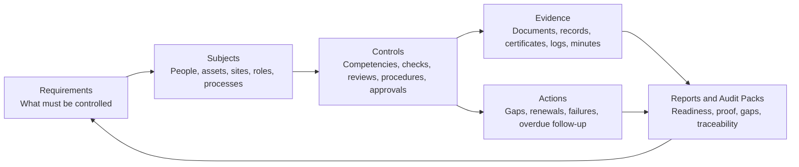
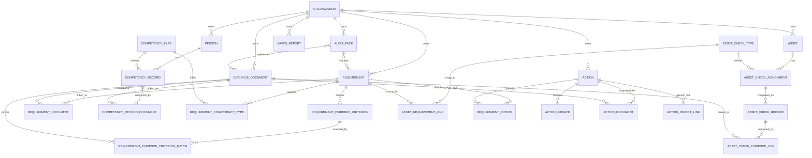
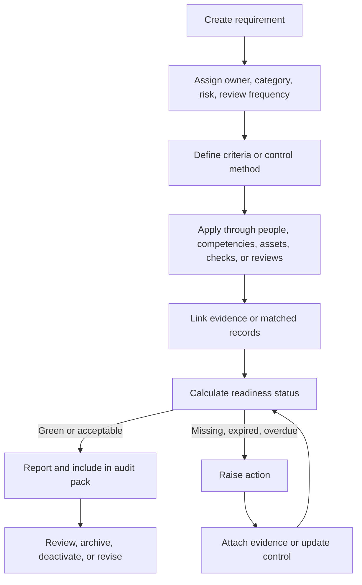
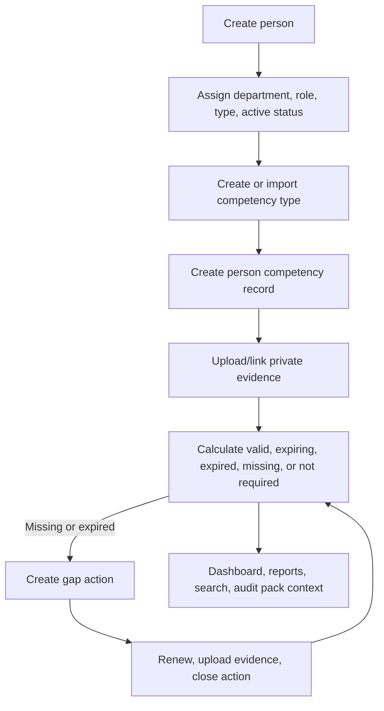
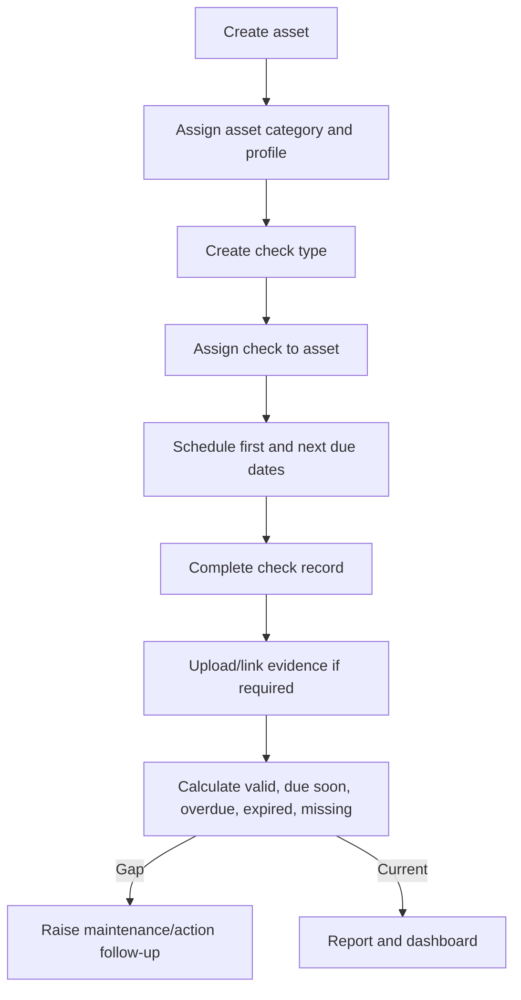
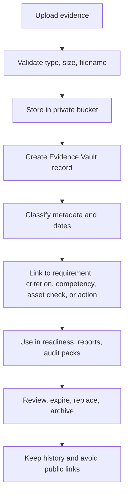
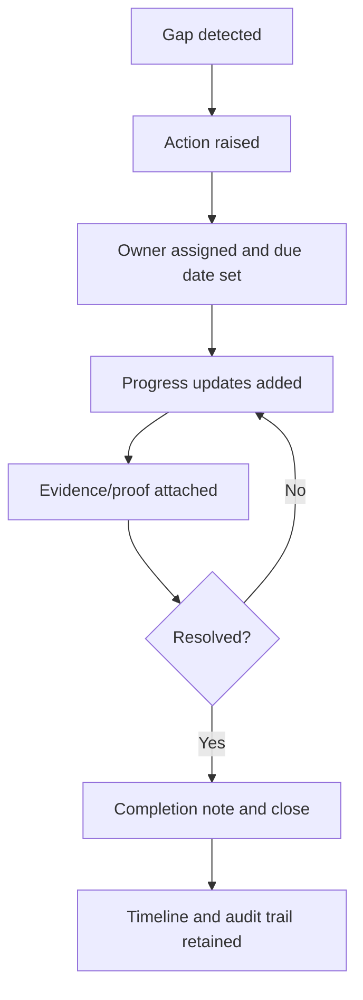
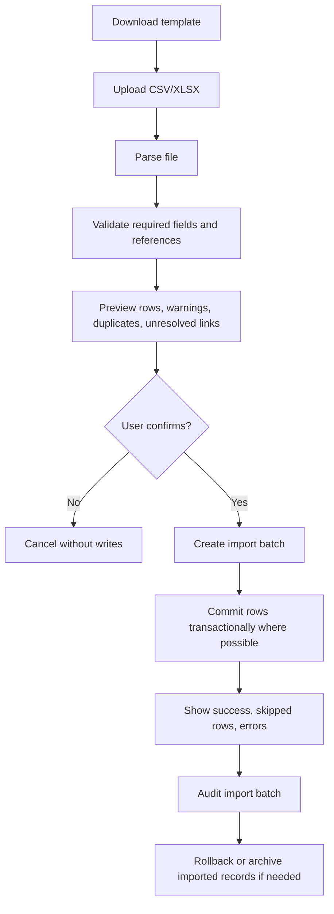

# LUMÉN Programme Model and User Guide

LUMÉN, formerly Vygilence/Vigilen, is an audit readiness and evidence intelligence workspace. It helps an organisation define what must be controlled, connect those controls to people and assets, store private evidence, track gaps, and prepare internal audit packs.

LUMÉN is not a legal, safety, certification, regulator, or standards-advice system. It does not create safety statements, method statements, risk assessments, legal documents, or guaranteed audit outcomes. External frameworks, customer requirements, legal obligations, and internal procedures can be represented as source material for requirements, but LUMÉN does not certify that any source has been satisfied.

This report is based on inspection of the current codebase at the accepted dashboard customisation checkpoint. Key implementation evidence includes:

- Dashboard and readiness surfaces in `src/app/dashboard/page.tsx`.
- Requirements lifecycle, template imports, evidence criteria, linked documents, linked competencies, linked actions, archive/inactive views, and action drawers in `src/app/dashboard/requirements/page.tsx`.
- People Matrix and Competency Registry in `src/app/dashboard/competencies/page.tsx`.
- Evidence Vault upload, metadata, archive, private signed open flow, and backlinks in `src/app/dashboard/vault/page.tsx`.
- Asset Matrix, asset categories, assignments, checks, evidence links, and history in `src/app/dashboard/matrix/page.tsx`.
- Audit Pack Builder in `src/app/dashboard/audit-packs/page.tsx`.
- Reports, saved report capabilities, print/CSV export, and metric glossaries in `src/app/dashboard/reports/page.tsx`.
- Audit Trail in `src/app/dashboard/audit-trail/page.tsx`.
- Workspace data loading and operations in `src/context/AppContext.tsx`.
- Supabase/local data service in `src/lib/db.ts`.
- Programme types in `src/lib/types.ts`.
- Readiness, evidence criteria, competency, and asset engines in `src/lib/readinessEngine.ts`, `src/lib/evidenceCriteriaEngine.ts`, `src/lib/competencyEngine.ts`, and `src/lib/assetEngine.ts`.
- Supabase schema and migrations in `supabase/schema.sql` and `supabase/migrations`.
- Existing module docs including `docs/REQUIREMENTS_ENGINE.md`, `docs/EVIDENCE_CRITERIA_ENGINE.md`, `docs/COMPETENCY_TRAINING.md`, `docs/COMPETENCY_REGISTRY.md`, `docs/EVIDENCE_VAULT.md`, `docs/ACTION_RECORDS.md`, `docs/ASSET_MATRIX_SYSTEM.md`, `docs/REPORTING_SUITE_STATUS.md`, `docs/FULL_PROGRAM_AUDIT_CODEX_REVIEW.md`, and `docs/DASHBOARD_CUSTOMISATION_SYSTEM.md`.

`docs/SUPABASE_STAGING_VERIFICATION_PLAN.md` was requested as a review input, but it is not present on this branch. That absence is treated as a readiness gap.

## 1. Executive Summary

The intended LUMÉN operating model is coherent:

Requirements define what must be controlled. People and assets are the things being controlled. Competencies, checks, reviews, procedures, and criteria are the structured controls. Evidence proves the controls. Actions fix the gaps. Reports and audit packs show readiness, proof, gaps, and traceability.

The current application mostly supports this model for local testing:

- Requirements are a strong master control layer with lifecycle states, evidence criteria, template packs, linked documents, linked competency types, linked actions, review dates, and archive/deactivate/delete controls.
- Evidence Vault is a central private evidence repository with metadata, signed URL opening, archive, duplicate detection, linked requirements, linked criteria, linked actions, linked competencies, and asset backlinks.
- Competency management supports people, competency types, person competency records, evidence links, expiry logic, gap actions, and a registry split.
- Asset Matrix supports assets, check types, assignments, check records, evidence links, categories, history, status logic, and requirement links at check-type level.
- Action Records provide a reusable gap/follow-up model with lifecycle dates, user-facing updates, linked documents, and generic object links.
- Audit packs are requirement-led and can include linked documents, missing evidence warnings, open actions, due/expiry warnings, CSV export, and print/save-as-PDF export.
- Reports and dashboard surfaces aggregate real app records and generally avoid fabricated historical trend claims.

The main gaps before bulk import are structural:

- There is no import-batch model, import staging table, rollback model, import run audit, or external stable ID mapping.
- Requirements can still become a dumping ground if imports do not distinguish requirement source, subject applicability, control method, evidence criterion, and evidence record.
- People and assets are not yet first-class "subjects" linked directly to requirements. They connect through competency types, asset check types, records, and evidence links, which is workable but incomplete for import mapping.
- Competency Registry has demo/local-only fields (`review_period_months`, `warning_days`) unless a future migration is approved.
- Asset requirement links are at asset check type level, not direct asset/applicability level.
- There is no versioning model for requirements, procedures, evidence replacements, imported batches, or source-system sync.
- Hosted Supabase verification remains a blocker for pilot/production.

Final recommendation: proceed to user review and bulk-import design, but build the importer around a staging/validation/preview/commit/rollback model, not direct writes into live tables.

## 2. Plain-English Model

### Requirements

A requirement is the master control object. It is something the business must satisfy, prove, review, or keep under control. It is not merely a document.

Requirements may come from:

- External framework-style clauses or customer audit questions.
- Customer-recorded ISO-style standards or clauses.
- Customer-recorded BRCGS-style requirements.
- Customer requirements.
- Legal or directive obligations recorded by the customer.
- Company procedures.
- Policies.
- Approvals.
- Qualifications.
- Calibrations.
- Service requirements.
- Drills.
- Inspections.
- Internal controls.
- Site checks.
- Asset checks.
- People and training requirements.

Use external framework names only as customer-controlled source labels. Do not present LUMÉN as certifying, interpreting, or guaranteeing compliance with any external framework or regulator.

### Subjects

Requirements apply to subjects. A subject is the person, thing, location, process, role, or group that is being controlled.

Subjects may include:

- People.
- Contractors.
- Roles.
- Assets.
- Vehicles.
- Equipment.
- Sites.
- Departments.
- Suppliers.
- Processes.
- Organisation-wide controls.

The current app has strong People and Asset objects but does not yet have a generic `subjects` abstraction. That is fine for MVP if imports map carefully into the existing People, Asset, Requirement, Competency, and Asset Check tables.

### Controls and Fulfilment Methods

A control or fulfilment method is how a requirement is satisfied in practice.

Examples:

- Competency.
- Training.
- Certificate.
- Asset check.
- Maintenance.
- Calibration.
- Inspection.
- Review.
- Approval.
- Procedure acknowledgement.
- Audit.
- Service record.

Current LUMÉN controls include evidence criteria, competency types, person competency records, asset check types, asset check assignments, asset check records, reviews, and actions.

### Evidence

Evidence proves that a control exists, is current, or has been completed.

Evidence may be linked to:

- Requirement.
- Evidence criterion.
- Person.
- Competency record.
- Asset.
- Asset check.
- Action.
- Audit pack.
- Review.
- Supplier or location in a future model.

In the current app, evidence is stored as private Evidence Vault documents and linked through relationship tables. Files use private Supabase Storage and signed URL opening in production mode.

### Actions

Actions exist when something is missing, overdue, failed, expired, unclear, or needs follow-up.

Actions should be raised from:

- Requirement gaps.
- Missing or expired evidence.
- Missing competency records.
- Failed or overdue asset checks.
- Audit findings.
- Future CAPA, non-conformance, risk, and customer audit modules.

The current app already has a reusable action shape through `actions`, `action_updates`, `action_documents`, and `action_object_links`.

### Reports and Audit Packs

Reports and audit packs are the output layer. They show readiness, evidence, gaps, traceability, and operational status. They should never claim that an external audit will pass.

Current reports include requirement readiness, evidence status, competencies, actions, assets, audit trail, saved report configurations, CSV export, and print/save-as-PDF workflows. Audit packs are internal packs built from selected requirements and linked documents.

## 3. Visual Programme Map

## 4. Entity Relationship Diagram

This diagram shows the target mental model and current implemented relationships. It is intentionally standards-agnostic.

## 5. Lifecycle Diagrams

### Requirement Lifecycle

### Person Competency Lifecycle

### Asset Assurance Lifecycle

### Evidence Lifecycle

### Action Lifecycle

### Bulk Import Model

## 6. Current App Fit Analysis

### Requirements

What works:

- `requirements` is the current master framework table.
- Requirements support title, description, owner, category, status, review frequency, review date, next due date, risk level, notes, lifecycle status, archive/deactivate/delete fields, organisation scope, created_by, and timestamps.
- The Requirements page supports create/edit, template-pack import, preview/select import, archive, restore, deactivate, safe delete checks, linked evidence, evidence criteria, linked competencies, linked actions, and action detail.
- Readiness uses active requirements only and excludes archived/deactivated/deleted requirements.

Partly supported:

- Requirement applicability to people/assets is indirect through competency types and asset check types.
- Evidence criteria can match documents, competency records, and actions, but the UI still carries legacy broad document links.
- Reviews exist as a table and as readiness inputs, but review workflow is not as mature as evidence/action workflows.

Missing or awkward:

- No source field for external requirement source, clause/reference, customer source, procedure source, version, or applicability rule.
- No generic subject assignment model.
- No import external ID.
- No versioning or controlled revision workflow.
- Requirement status is calculated in readiness, but stored `requirements.status` still exists and can confuse users if treated as authoritative.

Before bulk import:

- Add import columns or import mapping for source_system, external_id, source_reference, applicability_type, applicability_value, and import_batch_id.
- Decide whether import creates evidence criteria automatically.

### People

What works:

- `people` table supports employee number, names, email, department, role, person type, active state, start/end date, notes, organisation scope, and timestamps.
- Competency Matrix person drawer allows person profile review and management.
- People are used by competency records and search.

Partly supported:

- Role and department are free text, not controlled taxonomies.
- People are not directly linked to requirements.
- Person import is conceptually straightforward but no import UI or import validation exists.

Missing or awkward:

- No employment status history.
- No role-to-competency rule model.
- No person external ID uniqueness beyond employee number conventions.

Before bulk import:

- Define unique matching rule: employee_number first, email second, name only as warning.
- Add import preview for duplicate people and inactive/reactivated people.

### Competency Matrix

What works:

- Matrix builds people rows against active competency type columns.
- Status logic supports Valid, Expiring Soon, Expired, Missing, and Not Required.
- The engine uses map-based lookup for scale.
- Person workspace supports competency review, edit, evidence, and actions.

Partly supported:

- "Required for this person" is inferred from matrix/type presence, records, and Not Required status. There is no first-class assignment table saying which competency applies to which role/person.
- Archived/inactive competency types can be hidden, but applicability rules are limited.

Missing or awkward:

- A person with a role may need only a subset of competency types; today the matrix can still appear as if all active types apply unless marked Not Required.
- Bulk import of assignments and records must avoid creating accidental requirements for every person.

Before bulk import:

- Add person-to-competency assignment import semantics or a role/profile assignment layer.
- Treat Not Required as an explicit assignment outcome, not a data cleanup shortcut.

### Competency Registry

What works:

- `competency_types` supports title, category, description, validity/refresher periods, evidence_required, default risk, active state, and timestamps.
- Registry tab and detail workspace exist.
- Competency types link to requirements through `requirement_competency_types`.
- Global Search deep-links to `/dashboard/competencies?competency=<id>`.

Partly supported:

- `review_period_months` and `warning_days` exist in TypeScript/local/demo, but documentation says they are demo/local-only unless schema is extended.
- Default settings do not rewrite existing person records automatically, which is correct but must be explained.

Missing or awkward:

- No production migration for all registry convenience fields.
- No role-based competency templates.

Before bulk import:

- Decide whether warning/review fields are production fields and add migration if required.
- Import competency types separately from person competency records.

### Person Competency Records

What works:

- `competency_records` links person and competency type with completed date, expiry date, trainer, provider, certificate number, status, notes, organisation scope, and timestamps.
- `competency_record_documents` links evidence documents.
- Gap actions can be created and linked through the action model.

Partly supported:

- Records can be marked Not Required, but that mixes assignment/applicability with evidence outcome.
- Linked actions use generic object links in some flows.

Missing or awkward:

- No record version history beyond audit/activity logs.
- No import batch/source fields.

Before bulk import:

- Import records after people and competency types are matched.
- Require explicit person key and competency key per row.

### Evidence Vault

What works:

- Upload validates files and creates private evidence documents.
- Metadata includes category, title, issue/expiry/review/training/calibration dates, tags, custom metadata, original/safe filename, storage path, MIME type, size, uploaded_by, organisation_id, and status.
- Documents link to requirements, evidence criteria, actions, competency records, and asset checks.
- Detail/preview panels expose metadata and links.
- Archive/restore/permanent-delete marking exist.
- Authenticated open uses signed URLs; no public links are stored in normal flow.

Partly supported:

- Evidence can be linked widely, but link meaning is not always semantic. A broad requirement-document link is weaker than an evidence-criterion match.
- Evidence-only records are allowed and useful, but can become unclassified storage if not linked.

Missing or awkward:

- No virus/malware scanning.
- No evidence versioning/replacement chain.
- No import flow for metadata-only evidence.
- No external file reference model for files that cannot be uploaded yet.

Before bulk import:

- Support evidence metadata import without pretending files were uploaded.
- Support unresolved file references and later upload matching.
- Require link target validation and preview.

### Asset Matrix

What works:

- Asset categories, assets, check types, assignments, check records, evidence links, requirement links, and history events exist.
- Status engine calculates valid, due soon, overdue, expired, missing, not required, inactive, archived, and unknown.
- Asset workspace supports overview, checks, evidence, requirements, actions/history style tabs.
- Asset evidence uploads use Evidence Vault.

Partly supported:

- Requirement linkage exists at asset check type level through `asset_requirement_links`.
- Asset category tree/filtering exists, but remote migration verification is still pending.

Missing or awkward:

- Direct requirement-to-asset applicability is not first-class.
- Asset checks do not automatically become requirement fulfilment unless mapped carefully.
- Asset history is separate from audit trail and should not be confused with immutable audit logging.

Before bulk import:

- Import assets, categories, check types, and assignments separately.
- Validate category parent/child relationships within organisation.
- Map check types to requirements, not individual check records, unless the customer provides explicit evidence links.

### Asset Checks

What works:

- Check type defines frequency, warning window, evidence requirement, risk, and active state.
- Assignment defines per-asset required state, frequency override, due dates, last completion/expiry, status, notes, and active state.
- Check record captures completed_at, valid_from, valid_until, result_status, performed_by, reference, and notes.
- Evidence link connects documents to asset/check context.

Partly supported:

- Completing a check and linking evidence is present, but import/rollback/versioning is not.
- "Evidence required" drives missing status, which is useful but can surprise users if a check was completed without evidence.

Missing or awkward:

- No formal review/approval state for failed checks.
- No direct action generation rule for failed/missing checks.

Before bulk import:

- Separate assignment import from completion record import.
- Preserve completed records as history; do not overwrite them as current state only.

### Actions

What works:

- Actions have lifecycle dates, status changes, completion/cancellation notes, action updates, document attachments, requirement links, and generic object links.
- Action detail drawer is reused from requirements and vault.
- Actions appear in readiness and reports.

Partly supported:

- Requirement actions are the most mature link path.
- Generic object links are future-ready but not uniformly surfaced in every module.

Missing or awkward:

- No import model for actions.
- No formal verification/approval after action close.
- No action templates or escalation rules.

Before bulk import:

- Treat action import as phase 2 unless customers already have action registers.
- If importing actions, require external ID, owner, status, opened date, due date, and related object reference.

### Audit Packs

What works:

- Audit Pack Builder selects requirements, gathers linked documents, missing evidence warnings, due/expiry warnings, open actions, and competency warnings.
- Pack rows can be exported to CSV and print/save-as-PDF.
- Packs store requirement IDs and document IDs; files remain private and open through signed URLs.

Partly supported:

- Audit packs are internal packs, not secure external sharing.
- Pack content depends on link quality; weak links create weak packs.

Missing or awkward:

- No pack version snapshot of evidence metadata at creation time.
- No secure external portal or controlled external sharing.
- No pack approval workflow.

Before bulk import:

- Ensure imported requirements and evidence links are clean enough for pack generation.

### Reports

What works:

- Reports cover requirements, evidence, competencies, actions, audit packs, assets, and audit trail.
- Custom builder has a capability registry.
- CSV and print/save-as-PDF flows exist.
- Audit Trail data is owner/admin constrained in capability definitions.

Partly supported:

- Some saved report behavior can be local browser-backed depending on hosted migration state.
- Some comparison data uses current stored records over date windows, not a separate historical warehouse.

Missing or awkward:

- No scheduled reports.
- No production verification of saved report remote table in this branch.
- No import health report.

Before bulk import:

- Add an import run report once importer exists.

### Dashboard

What works:

- Dashboard reads real app collections and readiness report.
- It has KPIs, Compliance Core, quick actions, right rail, attention items, and customisation foundation.
- It avoids fake historical trend by showing current/snapshot wording where history is unavailable.

Partly supported:

- Dashboard customisation is local/user-level, not organisation-wide.
- Drilldowns depend on route params implemented in target modules.

Missing or awkward:

- No import-readiness widget or import error queue.
- No historical readiness trend dataset.

Before bulk import:

- Do not add fake trend cards. Add import status only when import batches exist.

### Global Search

What works:

- Searches requirements, actions, people, competency types, evidence metadata, audit packs, reports, audit trail for permitted roles, assets, and asset categories.
- Evidence file content is not indexed; metadata/search wording is honest in the UI.
- Routes deep-link to module pages.

Partly supported:

- Some deep-link behavior depends on target page support.
- Search is record metadata search, not document body search.

Missing or awkward:

- No search of import batches or unresolved import rows.
- No supplier/site/process records because those entities do not yet exist.

Before bulk import:

- Plan import batch search and imported external ID lookup.

### Audit Trail

What works:

- Audit Trail events have actor, category, entity, snapshots, changed fields, metadata, severity, undo fields, and source.
- Owner/Admin access control is present in UI and capability config.
- Sensitive keys are masked in the UI export/detail logic.

Partly supported:

- Older `audit_logs` and newer `audit_trail_events` both exist.
- Not all module actions have complete audit trail coverage according to module docs.

Missing or awkward:

- Import batches do not exist, so there is no import audit model.
- Undo is limited and should not be treated as general rollback.

Before bulk import:

- Add import batch audit events and per-row outcomes.

### Organisation and Admin

What works:

- Supabase Auth, onboarding, organisation row, organisation_members, profile, role helper functions, diagnostics, and production invitation honesty are present.
- Organisation isolation is central to schema and AppContext loading.

Partly supported:

- Production invites are disabled/honestly labelled unless a future server-side invite flow is added.
- Demo mode remains localStorage only when explicitly enabled.

Missing or awkward:

- No full production member invitation flow.
- No organisation-wide dashboard templates.

Before bulk import:

- Ensure import permissions are Owner/Admin only at first.

### Settings and Customisation

What works:

- Settings exposes diagnostics and demo reset/high-volume controls when appropriate.
- Dashboard customisation supports local pane visibility/order/detail/readability settings.

Partly supported:

- Dashboard customisation is local browser state, not server persisted.

Missing or awkward:

- No import settings page.
- No mapping templates saved per organisation.

Before bulk import:

- Add import templates and mapping presets only after the import model is designed.

### Bulk Import Readiness

What works:

- The target tables exist for most needed records.
- Many rows have organisation_id/organisation_id scope and RLS.
- Template import already exists for requirement packs and competency packs, but not arbitrary customer data.

Partly supported:

- High-volume demo generator proves local scale concepts, but it is not a customer import tool.
- CSV exports exist, but no symmetric import exists.

Missing or awkward:

- No import staging.
- No row-level validation UI.
- No rollback.
- No duplicate resolution.
- No external ID mapping.
- No file upload matching.

Before bulk import:

- Build import as a first-class subsystem, not as direct table inserts.

### Supabase and Schema Readiness

What works:

- `supabase/schema.sql` includes core tables and idempotent policy handling.
- Migrations exist for audit trail, saved reports, asset matrix, asset improvements, and asset categories.
- `supabase/storage_setup.sql` creates the private `evidence-documents` bucket and storage policies without mixing storage policy creation into the core schema.

Partly supported:

- Hosted Supabase migration state remains unverified on this branch.
- Some naming uses `organization_id`; newer tables often use `organisation_id`. The app handles both because legacy and new tables coexist, but imports must respect exact table names.

Missing or awkward:

- No import batch tables.
- No direct subject/applicability tables.
- No production columns for all Competency Registry UI fields.

Before bulk import:

- Decide whether to add import tables first or keep v1 import client-side preview plus direct commit with audit events. The recommended path is import tables.

## 7. Module-by-Module Explanation

### Dashboard

Use the dashboard to see current readiness, attention items, evidence upload shortcuts, and navigation into module records. It is a workspace view, not a certification scorecard.

### Requirements

Use Requirements to define the controls the organisation wants to maintain. A good requirement has a title, owner, category, risk level, review/due date, and evidence criteria. Archive or deactivate requirements that should no longer affect readiness.

### Evidence Vault

Use Evidence Vault as the private document and evidence metadata store. Upload files, classify them, add dates, and link them to the right requirement, criterion, competency record, action, or asset check.

### Competencies

Use People Matrix to see person-by-competency status. Use Competency Registry to manage the definitions of competencies that can be assigned or recorded for people.

### Asset Matrix

Use Asset Matrix to track assets, their required checks, evidence, due dates, and history. Asset checks are controls; asset check records and linked documents are evidence.

### Actions

Use actions for corrective or follow-up work. Actions should be raised when evidence is missing, a control is overdue, an asset check fails, or a competency expires.

### Reports

Use Reports to inspect data quality, readiness, evidence, competencies, assets, actions, and audit trail activity. Treat reports as operational summaries, not proof of external compliance.

### Audit Packs

Use Audit Packs to assemble selected requirements and linked evidence references into an internal review pack. The pack records references; it does not publish private evidence files.

### Audit Trail

Use Audit Trail to review important system events and changes. It is not a substitute for full import rollback or formal approval workflows.

## 8. Real-World Case Studies

### Case Study 1: Forklift Operator Training

Scenario: A company must ensure forklift operators have current training evidence.

Model:

- Requirement: "Forklift Operator Training".
- Subject: People whose role or job profile includes forklift operation.
- Control method: Competency type "Forklift Training".
- Record: Person competency record for each applicable person.
- Evidence: Training certificate uploaded to Evidence Vault.
- Dates: Completed date and expiry date on the competency record; expiry/review/training date on evidence where relevant.
- Action: Raised if record is missing, expired, or evidence is absent.
- Dashboard/report output: Personnel Training gaps, requirement readiness, open actions, and reports.
- Audit pack output: Requirement row with linked competency/evidence warnings and evidence references.

Current app support:

- Strong competency type, person, competency record, evidence link, and action support.
- Requirement can link to competency type.
- Readiness engine considers linked competency type records.

Awkward points:

- No role-to-competency rule model. Users may need to mark Not Required manually.
- Requirement applicability to specific people is indirect.
- Competency Registry warning days may be local-only unless migrated.

Recommended improvements:

- Add role/person competency assignment rules.
- Add import templates for people, competency types, assignments, and records.
- Add clear "applies to" display on requirement detail.

### Case Study 2: Vehicle or Asset Inspection

Scenario: A vehicle or forklift requires scheduled checks and evidence.

Model:

- Requirement: "Vehicle Inspection Records" or "Forklift Inspection Records".
- Subject: Asset or asset category.
- Control method: Asset check type and assignment.
- Evidence: Inspection sheet, service record, certificate, or maintenance record.
- Due logic: Assignment next_due_date and record valid_until.
- Action: Raised if overdue, failed, expired, or evidence-required check has no evidence.
- Report output: Asset Matrix status, asset reports, dashboard Asset Assurance.

Current app support:

- Assets, asset categories, check types, assignments, check records, evidence links, and history exist.
- Asset status engine supports due/overdue/missing/expired.
- Asset check types can link to requirements.

Awkward points:

- Requirement-to-asset applicability is check-type based, not direct.
- Failed check to action linkage is not fully automatic.
- Asset history and audit trail are separate.

Recommended improvements:

- Add explicit requirement applicability for asset category/type.
- Add optional rules to create actions from failed/overdue checks.
- Include import mapping for assets, check types, assignments, records, and evidence links.

### Case Study 3: Policy or Procedure Acknowledgement

Scenario: A company policy must be reviewed and acknowledged by staff.

Model:

- Requirement: "Policy Acknowledgement".
- Subject: People, roles, departments, or all staff.
- Control method: Procedure acknowledgement or review.
- Evidence: Signed acknowledgement, digital confirmation, meeting record, or training record.
- Review frequency: Annual or custom.
- Exceptions: People not in scope, inactive people, contractors outside scope.
- Action: Raised for missing acknowledgements or overdue review.
- Reporting: Requirement readiness, people exception report, action list.

Current app support:

- Requirement, review date, evidence criteria, person records, and actions can represent this.
- Evidence Vault can store signed acknowledgements.

Awkward points:

- There is no procedure acknowledgement object.
- No role/dept applicability rules.
- Bulk acknowledgement imports would have to map to evidence or competency records.

Recommended improvements:

- Add a lightweight acknowledgement/control record type later, or model policy acknowledgements as competency records with a clear category.
- Add role/department applicability before large imports.

### Case Study 4: Evidence Vault Audit Preparation

Scenario: An auditor asks for evidence for a selected set of requirements.

Model:

- Requirements selected.
- Linked evidence reviewed.
- Missing evidence warnings surfaced.
- Open actions reviewed.
- Audit pack created.
- CSV or print/save-as-PDF output produced.
- Audit trail logs export operations.

Current app support:

- Audit Pack Builder selects active requirements and shows linked documents, warnings, open actions, and due/expiry warnings.
- Evidence files remain private and open through signed URLs.
- CSV and print/save-as-PDF exports are available.

Awkward points:

- Pack snapshot/versioning is limited.
- External sharing is not production implemented.
- Quality depends on evidence criteria and links being configured correctly.

Recommended improvements:

- Add pack snapshot metadata.
- Add pack review/approval state.
- Add secure external sharing only after server-side controls are designed.

### Case Study 5: Bulk Import from Existing Systems

Scenario: A customer uploads people, assets, requirements, and evidence metadata from existing systems.

Model:

- User downloads templates.
- User uploads CSV/XLSX.
- App parses and validates rows.
- App resolves links by external IDs or natural keys.
- User previews errors, warnings, duplicates, and unresolved links.
- User confirms import.
- App creates import batch, writes records, logs outcomes.
- User can rollback or archive imported records if a batch is wrong.

Current app support:

- Target modules and tables mostly exist.
- Template imports exist for requirement and competency starter packs.
- High-volume demo generator proves local scale but is not a customer import system.

Awkward points:

- No import batch table.
- No external ID fields.
- No validation preview UI.
- No rollback.
- No unresolved-link holding area.

Recommended improvements:

- Build a dedicated import subsystem before customer bulk uploads.
- Start with Requirements, People, Assets, Competency Types, and Evidence Metadata.
- Add relationship imports only after base records can be matched reliably.

## 9. New User Walkthrough

### What LUMÉN Is

LUMÉN is a workspace for organising operational requirements, private evidence, people competency records, asset checks, actions, reports, and internal audit packs.

### What LUMÉN Is Not

LUMÉN does not give legal advice, safety advice, certification advice, or guarantees. It does not create formal safety or legal documents. It stores and organises the evidence and actions that your organisation chooses to manage.

### Key Concepts

- Requirement: what must be controlled.
- Subject: who or what the requirement applies to.
- Control: how the requirement is fulfilled.
- Evidence: proof that the control exists or is current.
- Action: follow-up when something is missing or overdue.
- Report or audit pack: output showing status, proof, and gaps.

### First Setup Steps

1. Confirm the organisation workspace is correct.
2. Create or import starter requirements.
3. Add people.
4. Add competency types.
5. Add assets and asset categories.
6. Add asset check types and assignments.
7. Upload evidence.
8. Link evidence to requirements, criteria, competencies, actions, or asset checks.
9. Review dashboard gaps and raise actions.

### How to Create Requirements

Create requirements for the things your organisation must maintain or prove. Use plain titles such as "Forklift Training", "Vehicle Inspection Records", "Procedure Review", or "Contractor Induction". Add owner, category, risk, review frequency, and next due date.

For stronger readiness scoring, define evidence criteria instead of relying only on broad document links.

### How to Add People

Add each person with name, employee number, email, department, role, person type, start/end date, active status, and notes. Use employee number or email consistently because imports and matching will need stable keys.

### How to Manage Competencies

Create competency types in the registry, then manage person records in the People Matrix. Add completed date, expiry date, provider/trainer, certificate number, notes, and evidence. Mark a record Not Required only when that competency truly does not apply.

### How to Add Assets

Create asset categories first if useful. Add asset number, name, type, registration or serial number, make/model, location, department, owner, and status. Then create check types and assign them to assets.

### How to Upload Evidence

Upload files through Evidence Vault or from a linked workflow such as action, competency, or asset check. Add useful metadata immediately: title, category, issue date, expiry date, review date, tags, and custom attributes.

### How to Link Evidence

Link evidence to the precise thing it proves. A document can support multiple requirements, criteria, actions, competency records, or asset checks. Prefer evidence criteria matches for requirement proof.

### How to Respond to Gaps

If a requirement, competency, asset check, or document is missing or overdue, create an action. Assign an owner and due date. Add updates and attach evidence before closing.

### How to Build an Audit Pack

Open Audit Packs, choose requirements, review missing evidence warnings, open actions, due/expiry warnings, then save the pack. Export CSV or print/save as PDF for internal review. Evidence files remain private.

### How to Use Reports

Use Reports to review requirements, evidence quality, competencies, assets, actions, audit packs, and audit trail events. Use exports for operational review, not as a guarantee of external audit success.

### How to Use Dashboard

Use Dashboard as the daily summary: readiness score, attention items, quick upload, expiring evidence, open actions, and module drilldowns. Dashboard customisation is currently local to the user/browser.

### Weekly and Monthly Maintenance

Weekly:

- Review overdue requirements and open actions.
- Upload and link new evidence.
- Check expiring evidence and competencies.
- Complete due asset checks.

Monthly:

- Review requirement ownership and categories.
- Archive or deactivate stale requirements.
- Review unlinked evidence.
- Review audit trail and exports.
- Generate readiness and evidence reports.

### Common Mistakes to Avoid

- Treating a document as a requirement.
- Uploading evidence but not linking it.
- Linking evidence broadly without criteria.
- Creating competency records without deciding who they apply to.
- Creating asset checks without mapping them to a requirement source.
- Using Not Required to hide unknown data.
- Importing data without stable external IDs.
- Assuming demo/local features prove production readiness.

## 10. Bulk Import Readiness

### Import Types

| Import type | Purpose | Required fields | Optional fields | Linked records required | Validation risks | Current app support | Future schema needs |
|---|---|---|---|---|---|---|---|
| Requirements | Create master controls | title, category, risk_level, review_frequency | description, owner, review_date, next_due_date, notes, source_reference | none for base import | duplicates, vague titles, wrong lifecycle | table/UI exists | source/external_id/import_batch/applicability recommended |
| People | Create controlled people | first_name, last_name or display_name | employee_number, email, department, role, type, dates, notes | none | duplicate names, reused emails, inactive people | table/UI exists | external_id/import_batch recommended |
| Assets | Create controlled assets | name, asset_type | asset_number, category, registration, serial, make/model, location, owner | category optional | duplicate asset numbers, category mismatch | table/UI exists | external_id/import_batch recommended |
| Competency Types | Define competencies | title, category | validity/refresher, evidence_required, risk, active | none | duplicate title/category, local-only fields | registry exists | production fields for warning/review if needed |
| Person-to-Competency Assignments | Define applicability | person_key, competency_key, required/not_required | role/profile source | people, competency types | accidental all-person requirements | partly through records/Not Required | assignment table or role profile recommended |
| Person Competency Records | Import completions | person_key, competency_key, status | completed_date, expiry_date, trainer, provider, cert number, notes | people, competency types | record overwrites, date parsing, missing person | table/UI exists | external_id/import_batch/version recommended |
| Asset Check Types | Define recurring asset controls | title, category, evidence_required | frequency, warning days, risk | none | ambiguous check names | table/UI exists | external_id/import_batch recommended |
| Asset-to-Check Assignments | Apply checks to assets | asset_key, check_type_key, required | frequency overrides, due dates, notes | assets, check types | duplicate assignment, wrong category | table/UI exists | import_batch recommended |
| Asset Check Records | Import historical/current checks | asset_key, check_type_key, completed_at | valid_from, valid_until, result, reference, notes | asset, check type, optional assignment | losing history, invalid date ranges | table exists | external_id/import_batch recommended |
| Evidence Metadata | Register evidence records | title, original_file_name or external_file_ref, category | dates, tags, metadata, status | none initially | pretending files uploaded, missing file links | Evidence Vault exists | external_ref, upload_status, import_batch recommended |
| Evidence-to-Requirement Links | Link evidence to requirements | evidence_key, requirement_key | notes | evidence, requirement | weak proof if criteria absent | table exists | import warnings for criteria missing |
| Evidence-to-Criterion Links | Strong evidence proof | evidence_key, criterion_key | notes, match_status | evidence, criteria | wrong criterion, expired evidence | table exists | import preview needed |
| Evidence-to-Person Links | Link evidence to person context | evidence_key, person_key | relationship type | evidence, person | no direct table today | not directly supported | subject/evidence link table recommended |
| Evidence-to-Asset Links | Link evidence to asset/check | evidence_key, asset_key, check_type/record | notes | evidence, asset/check | unscoped asset links | supported via asset check evidence links | direct asset evidence link optional |
| Evidence-to-Competency Links | Link evidence to competency record | evidence_key, competency_record_key | notes | evidence, competency record | missing record creation order | table exists | import preview needed |
| Actions | Import corrective/follow-up items | title, status, owner, opened_at or created_at | due date, notes, linked object | related object optional | imported stale actions, closed state mismatch | table exists | import later with object links |

### Recommended Build Order for Bulk Import

1. Import batches, row staging, validation result, and rollback design.
2. Requirements import.
3. People import.
4. Assets import.
5. Competency types import.
6. Asset check types import.
7. Person competency records import.
8. Asset check assignments and records import.
9. Evidence metadata import.
10. Evidence link imports.
11. Actions import after base objects are stable.

## 11. Structural Risks

| Risk | Real-world example | Impact | Recommended fix |
|---|---|---|---|
| Requirements become a dumping ground | User creates "John forklift cert" as a requirement | Readiness becomes noisy and unmaintainable | Train users and importer to separate requirement, subject, control, and evidence |
| People/assets disconnected from requirements | Forklift requirement exists but does not say which people/assets it applies to | Gaps are hidden or overstated | Add applicability rules through roles/categories and optional direct links |
| Evidence linked to files but not obligations | Certificate uploaded but unlinked | Audit pack misses proof | Import/link validation and unlinked evidence dashboard |
| Competency records without requirement context | Training matrix exists but no requirement source | Readiness cannot explain why training matters | Link competency types to requirements or role profiles |
| Asset checks without requirement source | Daily checks exist but not tied to a control requirement | Reports show activity without obligation context | Link check types to requirements and categories |
| Imported records lack stable external IDs | Same employee imported twice under slight name variants | Duplicate people and false gaps | Require external_id or deterministic matching |
| No rollback | Import creates 500 wrong records | Manual cleanup is slow and risky | Add import batch and reversible operations |
| Lack of versioning/history | A procedure changes but old evidence stays linked | Audit context becomes unclear | Add version/replacement fields for requirements/evidence later |
| Demo/local mistaken as production | Local saved reports or registry fields treated as remote | Customer pilot fails after deployment | Label local-only fields and verify hosted Supabase |
| Unclear ownership | Imported requirements have no owner | Nobody closes gaps | Require owner or default owner in imports |
| Weak approval/review workflow | Evidence is uploaded but never reviewed | Bad evidence appears ready | Add review/approval workflow later |
| Confusing evidence/control/action terms | User creates actions as evidence | Reports become misleading | Plain language guide and import validation |

## 12. Target Model Recommendation

### Recommended Entity Names

Keep current names where possible:

- Organization.
- Requirement.
- Requirement Evidence Criterion.
- Person.
- Competency Type.
- Competency Record.
- Asset.
- Asset Category.
- Asset Check Type.
- Asset Check Assignment.
- Asset Check Record.
- Evidence Document.
- Action.
- Review.
- Audit Pack.
- Saved Report.
- Audit Trail Event.

Add later:

- Import Batch.
- Import Row.
- External Reference.
- Applicability Rule.
- Subject Link or Control Subject.
- Evidence Version or Replacement Link.
- Requirement Source.

### Recommended Relationships

- Requirement defines control expectation.
- Requirement can have criteria.
- Requirement can link to competency types.
- Requirement can link to asset check types.
- Requirement can link directly to evidence where criteria are not configured, but this should be labelled as weaker.
- Person has competency records.
- Asset has check assignments and check records.
- Evidence can link to multiple proof targets.
- Action can link to any operational object through `action_object_links`.

### Recommended Status Logic

- Requirement readiness: Green 100, Amber 50, Red 0, Grey excluded.
- Evidence criteria should drive requirement coverage.
- Legacy document links should not automatically prove coverage when criteria are required.
- Competency status should use person record expiry and Not Required explicitly.
- Asset status should use assignment required state, due dates, check records, valid_until, and evidence_required.
- Archived/deactivated/deleted items should be excluded from active readiness.

### Recommended Ownership Logic

- Requirement owner owns the control.
- Person record owner can default to department/manager later.
- Asset owner owns check completion.
- Action owner owns closure.
- Evidence uploaded_by is not necessarily evidence owner.
- Import owner is the user who commits the batch.

### Recommended Evidence Linking Model

Evidence should be linked at the most precise level available:

1. Evidence criterion match.
2. Competency record link.
3. Asset check record or assignment link.
4. Action attachment.
5. Broad requirement document link only when criteria are not configured.

### Recommended Import Model

Use staged imports:

- Upload.
- Parse.
- Validate.
- Preview.
- Resolve duplicates and missing links.
- Confirm.
- Commit batch.
- Log audit events.
- Roll back or archive batch-created records if needed.

### Recommended Dashboard and Reporting Model

- Dashboard should show current operational state only.
- Historical trends should require persisted history.
- Reports should expose calculation basis.
- Import status should appear only after import batches exist.

### Direct or Indirect Requirement Application

Requirements should be applied both directly and indirectly:

- Direct links are useful for simple cases: one requirement applies to one asset, one person, or one location.
- Indirect rules are better at scale: role requires competencies, asset category requires checks, department requires procedures, organisation-wide requirements apply to all.

Recommended approach:

- Person requirements: use role/profile rules, with optional direct person overrides.
- Role requirements: define role-to-competency/applicability rules.
- Asset requirements: use asset category/check type rules, with direct asset overrides.
- Asset category requirements: preferred default for recurring checks.
- Organisation-wide requirements: no subject or subject type `organisation`.
- Procedure/policy requirements: use review plus acknowledgement/control records later.
- Evidence-only records: allowed but flagged until linked or classified.
- Recurring checks: asset check assignments and records.
- Competency expiry: person competency record expiry.
- Asset check expiry: asset check record valid_until and assignment next_due_date.

## 13. What Should Be Fixed Before Bulk Import

1. Add import batch and import row model.
2. Add external_id/source_system mapping strategy.
3. Add import preview and validation UI.
4. Add rollback/archive strategy for imported rows.
5. Add duplicate matching rules for requirements, people, assets, competency types, and evidence metadata.
6. Add explicit applicability model or define temporary import conventions for people/assets.
7. Decide production schema for Competency Registry warning/review fields.
8. Add evidence metadata import without fake uploaded-file state.
9. Add unresolved link handling.
10. Add import audit trail and reports.
11. Verify hosted Supabase migrations and storage setup.
12. Add browser smoke tests for import flows before customer data is used.

## 14. What Can Wait Until Later

- Full external standards mapping.
- AI/OCR/document text extraction.
- Secure external audit portal.
- Report scheduling and delivery.
- Organisation-wide dashboard templates.
- Full evidence versioning.
- Formal approval workflow for every evidence record.
- Supplier/site/process modules.
- Action escalation rules.
- Data warehouse style historical trend store.

## 15. Final Recommendation

The current app is aligned with the intended programme model strongly enough for product review and bulk-import design. It should not receive a direct "upload spreadsheet and write to live tables" feature. The correct next step is a staged import subsystem that protects the model from bad source data.

Recommended immediate design principle:

> Requirements say what must be controlled. Subjects say who or what it applies to. Controls say how it is fulfilled. Evidence proves it. Actions fix gaps. Reports and audit packs explain the result.

Use this principle as the test for every import template and every future module.
